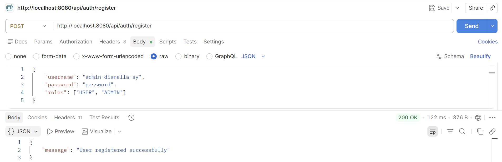
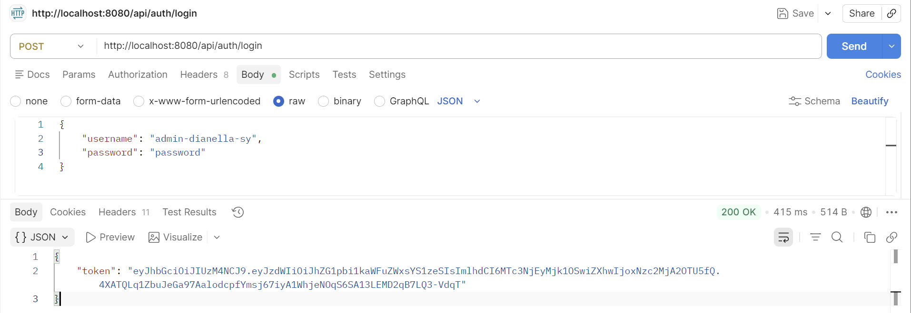
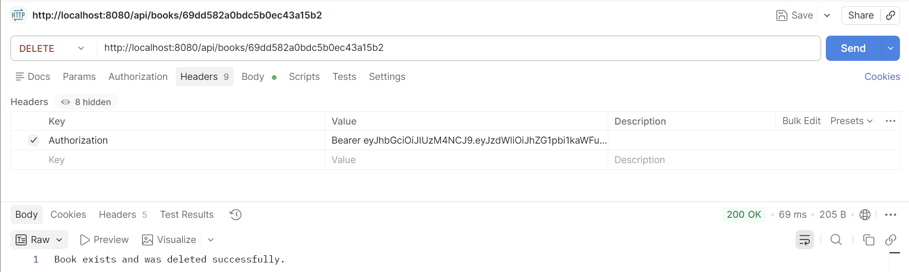
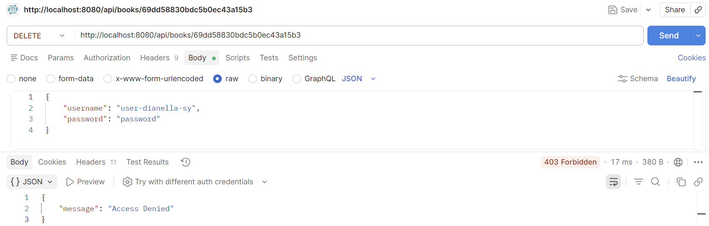

# JWT Role-Based Authorization

## Register the ADMIN User (200 OK Response)

## Login as ADMIN and Token Visible in Response

## DELETE Request as ADMIN - 200 OK with Success Message

## Delete Request as USER - 403 Forbidden Response
